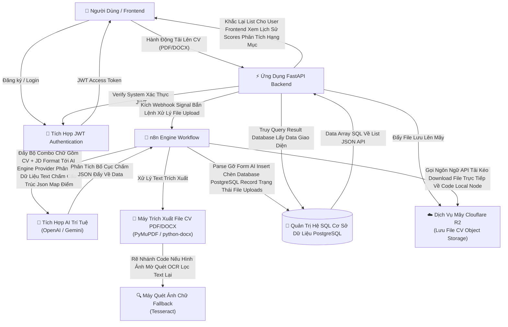
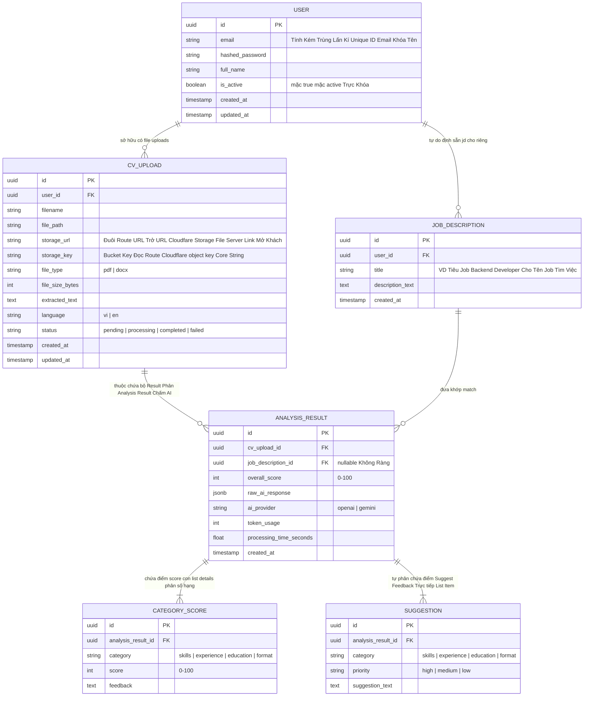

# Thiết Kế Hệ Thống & Kiến Trúc

## Tổng Quan Kiến Trúc (Architecture Overview)
**Cấu trúc hệ thống cấp cao là gì?**

### Key Components & Nhiệm Vụ Liên Quan
| Thành Phần API Component | Quyền Hạn Nhiệm Vụ Hệ Thống |
|-----------|---------------|
| **BackEnd Viết Lõi FastAPI** | REST API Service Chính, Hệ auth JWT token, Gọi Nhận Xử Lí Files Form File Data Chạy Webhook Kích Hoạt N8N. Build Endpoints Route Truy lịch sử API CV. |
| **System Lớp Cổng Authentication JWT** | Token Generation Creation Dùng Cổng Cấp User Register Tự Tạo Acc |
| **Cỗ Máy Chạy Tự Động Hóa Workflow n8n** | Nền tảng luồn tự do logic Data Pipeline : Mở Tái Tiếp Webhook FastAPI Nhận UUID Data Info Móc Đọc Kéo Lấy PDF Cloudflare Read Parse -> Thảy Vào Trải OpenAI Text Chấm Text Xong Parse Rút Database Sql Trả . |
| **AI LLM Core AI Provider Platform Service** | Prompt Nhận Hệ Đọc Văn Bản Tự Động Cho Điểm Rate Theo Form Cơ Số Data (100) Cấp . Gợi Đề Nhận Xét Gạch Đầu Dòng. |
| **Kho Postgres CSDL Relational Relational PostgresSQL** | Core Data Nền Quản Lí Record Storage Tích Dấu Users Login Auth, Metadata System Bảng Data CV Uploads Nguồn Chứa Record Khâu API AI History Truy Dữ Liệu Lịch Sử Nhanh. |
| **Storage Object Service Form File Cloudfare R2** | Storage Lưu File Sạch Cực Thể Khổng Lồ Giữ Data Của Ứng Dụng . Tương Định AWS Đẩy File Giành API S3 Sạch |

### Cấu Trúc Ngôn Ngữ Stack Sử Dụng Dự Án Đóng Gói Kĩ Thuật Dev
| Cấu Trúc | Nền Tảng | Lí Do Setup Tool Chọn Tool |
|-------|-----------|-----------|
| API Backend Code Root | Hệ Framework FastAPI Core Chạy Python 3.11+ | Nhanh Mượt Hệ Đồng Giao Thông Nhẹ Async Trực Đều Hữu Dụng Dev Có Swagger Nền Hệ Sinh Thái Module Thư Viên OpenSource Đa Lựa Trùng . |
| Kênh System Authorization | Công Thức Chuẩn Bảo Mật JWT (Với Pack `python-jose` pass Cứng `passlib`) | Stateless Không Phiên Đơn System Trực Tuyến Chịu Scale Client Tải Chuẩn REST Phối Web SPA React Tốt . |
| Bộ Code Động Engine Điều Tiết | Workflow GUI n8n Hệ Mở Source Đóng Self Host Đẩy Gấp | Setup Cấu Pipeline Vẽ Đồ Trực Giảng Nối API webhook Không Code Phức Cứng Logic Handle Quản Lí Thường Ngành Kĩ Code. |
| Cơ Sở Rễ Data Postgres SQL | Version Stable 16 Bản Chạy Node Cấp PostgreSQL | Mạnh Chuẩn Ổn JSONB Rã Hỗ Có Bắn Dữ Data Phản Type Về. |
| Kho Cấu File Chứ Đám Mây Mảng AWS | CloundFlare R2 Protocol Chuẩn S3 Giao API Khẩu Cấp | File Kho Free Phí Egress Data Truy Rẻ Setup Kéo Lưu An Tiện Gỡ Cực S3 Dạng Cứng Code. |
| Extractor Dò Rút Text Bắn Scan Data Văn | Module Pack Code `PyMuPDF` Kèm Thư Mở `python-docx` Cho Read World Win Code | Ổn Đinh Text Text Render Extract Font Parse Kéo Tách Cụm Tốt Xử . |
| Rút OCR Scan PDF Lọc Text Tự Bể Ảnh | Tesseract AI Optical Vision Code | Nền Code Đóng Cứu Mở Quét Khống Thư Rỗng Chữa Lỗi Do Scan Thấy Bản PDF Text Trống Cứng Image . |

## Cấu Trúc Schema Bảng Data Cơ Model Table Data

## API Endpoint Design Router Endpoint List Giao Tiếp API
**Tương Kết API Bằng Cách Nào**

### JWT Lớp Login Endpoint Auth Token Cấp Authentication Giao Dịch
* `POST /api/v1/auth/register`: Cấu Hình Khởi Email Pass Name Payload Data. Lập Data Database Account User .
* `POST /api/v1/auth/login`: Lọc Check Đánh Hash Truy Ra User Trúng Email . Nén Generate Phát Khóa Bearer Access Token Trả Payload .

### Tệp Các Route Thể Tương Giao Tác CV CV Upload & Lấy File API Endpoint (FastAPI) (🛡️ Protected Lớp Headers Token Bearer)
* `POST /api/v1/cv/upload`: Đầu Server Web Xử Lý Gọi Data Multipart Bắn Đính Tệp Kèm Data Optional File , Kích Gửi JD Info Truy Lên Cho CSDL Tự Đẩy Key AWS S3 Hàm Cloudflare SDK. Trả User `cv_upload_id` Đợi Tải Status Trạng .
* `GET /api/v1/cv/{id}/result`: Bóc Đưa List Json Phả Truy Xuất Result List Point Scores Từng Feedback Suggestions Về . Check Quyền Của Có Đúng Của Acc Auth Đăng Nhập Không .
* `GET /api/v1/cv/history`: Bắn Kèm List Point Danh Sách Trang Trạng Lọc Lấy Query Phân Có Trang Sort Mới Get Truy.
* `GET /api/v1/cv/compare`: Truy Query Lọc Theo Array Group Nhiều UUID Compare 3 Dòng So CV Form Ra Xem So Phân .

### Nhóm Route Cấu Quản Tác Lưu File (Job Description CRUD) (🛡️ Protected)
* `POST /api/v1/jd`: Insert Lệnh Ghi Khối Group Model Job Mới.
* `GET /api/v1/jd`: Filter Where Trả Toàn Dòng Model Khối Acc Lọc DB Do Đăng ID Job Sẵn .

### Internal Khối Data Bắn Mạch Webhook (Tự Từ API Bắn Internal Sang n8n Cổng Phân)
* `POST {N8N_WEBHOOK_URL}/webhook/analyze-cv` Lệnh Gọi API HTTPX Lên Service N8n Body Dùng Core Chuyển Thể JSON Đẩy Data Info Khóa Key DB Kèm . 

## Breakdown Bóc Thể Kiến Hệ Thiết Build Architecture 
**Khối Xây Code Làm Từng Chặng**
- Module Routing Lên Trục Đầu Lọc Dòng Data Auth JWT Mạch Kín Service FastAPI Nhóm API Bắn API Upload DB Call N8N 
- Module SQL Nền Database Relational Query Core Hệ Model Thống 
- Module Docker Services Phân 3 Image Up Tải Server Khép Dịch Vụ System Phục Vụ . 

## Quản System Security Non-Functional Test Request Tác Động Độ Mượt Performance 
- File up stream Mất Đĩa 0 Dòng Cache RAM Tắt . 
- JWT Authentication Mạch Encode Code Giải Mật Khẩu Cho Endpoints Security Khóa API Rate Limit Tự Request Khỏi Tấn Hack Spam Tệp. 
- API Caches Token Hash Token Database CV Tự Auto So Result Thay Cho Gọi Báo Cáo Không Cần Token Lên LLM Khỏi AI Check Dòng Y Khác Token Phí Rate Limit .
