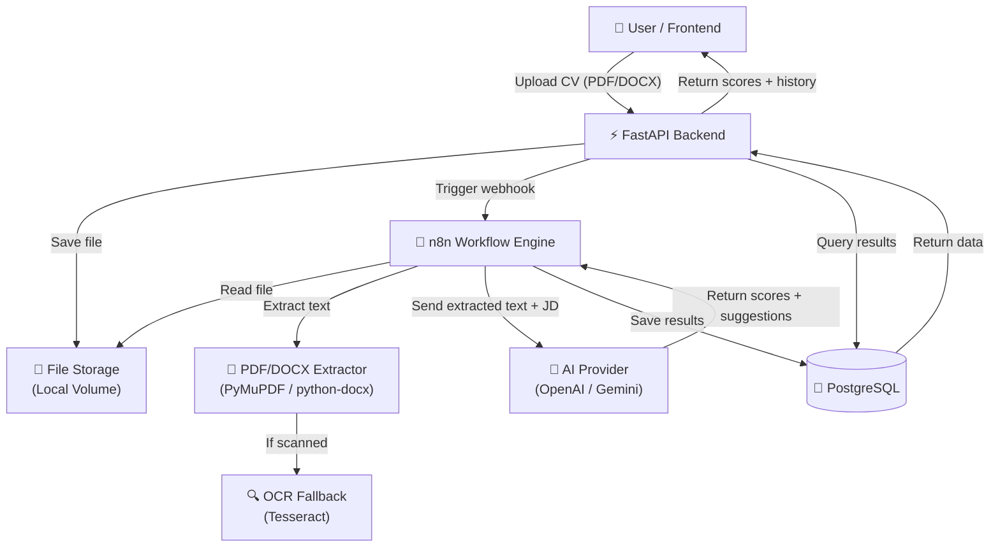
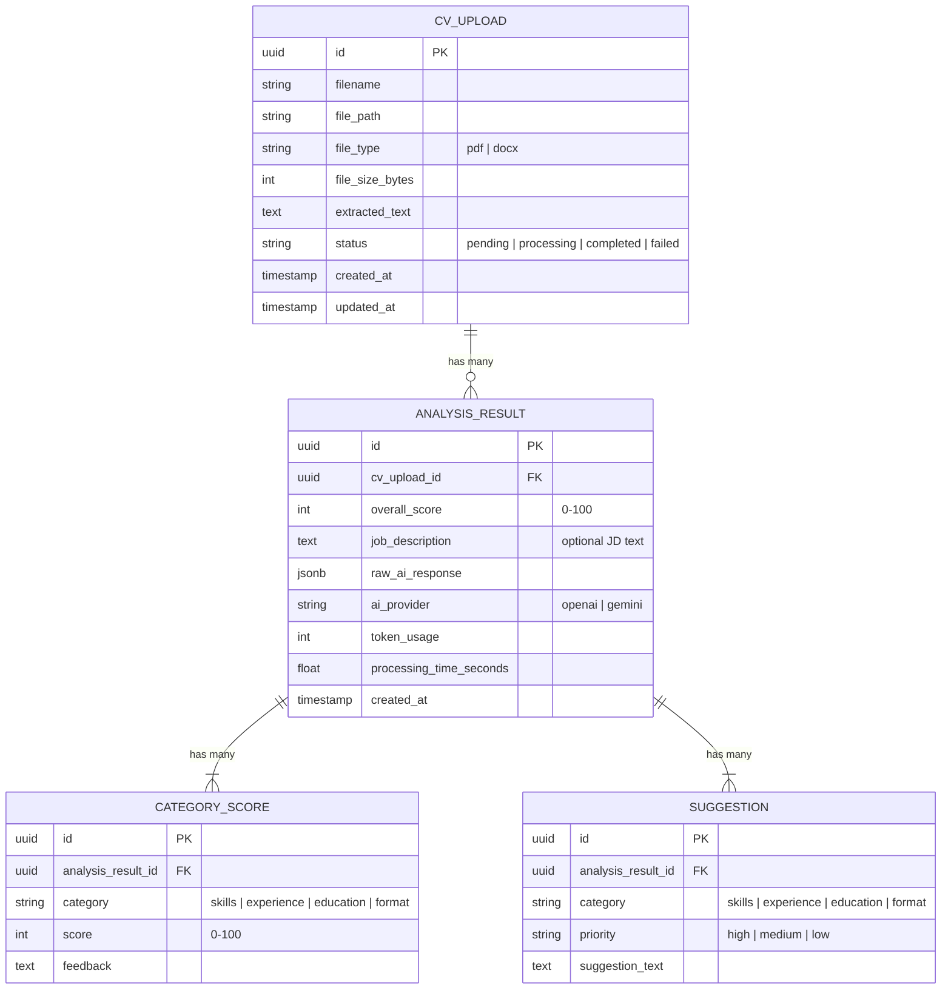

# System Design & Architecture

## Architecture Overview
**What is the high-level system structure?**



### Key Components & Responsibilities

| Component | Responsibility |
|-----------|---------------|
| **FastAPI Backend** | REST API, file upload handling, webhook trigger to n8n, results querying, history endpoints |
| **n8n Workflow** | Orchestrates the pipeline: receive webhook → extract text → call AI → parse response → save to DB |
| **AI Provider** | Analyzes CV text, generates scores (0–100) with breakdown and improvement suggestions |
| **PostgreSQL** | Persistent storage for CV metadata, extracted text, AI scores, and analysis history |
| **File Storage** | Temporary/permanent storage for uploaded CV files (Docker volume) |

### Technology Stack

| Layer | Technology | Rationale |
|-------|-----------|-----------|
| Backend API | FastAPI (Python 3.11+) | Async, fast, auto-docs (Swagger), great Python ecosystem |
| Workflow Engine | n8n (self-hosted) | Visual workflow builder, webhook support, extensible with custom code nodes |
| Database | PostgreSQL 16 | Robust, JSONB support for flexible AI response storage |
| Text Extraction | PyMuPDF + python-docx | PyMuPDF for PDF, python-docx for DOCX, fast and reliable |
| OCR | Tesseract OCR | Open-source OCR fallback for scanned PDFs |
| AI | OpenAI GPT-4 / Google Gemini | State-of-the-art language models for CV analysis |
| Containerization | Docker Compose | Single-command deployment of all services |

## Data Models
**What data do we need to manage?**

### Entity Relationship Diagram



### Data Flow
1. **Upload:** File saved to storage → metadata row inserted into `cv_upload` (status: `pending`)
2. **Processing:** n8n extracts text → updates `cv_upload.extracted_text` → status: `processing`
3. **AI Analysis:** n8n sends text to AI → receives JSON response → inserts `analysis_result`, `category_score`, and `suggestion` rows → status: `completed`
4. **Query:** FastAPI reads from DB, joins tables, returns structured response

## API Design
**How do components communicate?**

### External REST API (FastAPI)

#### `POST /api/v1/cv/upload`
Upload a CV file for analysis.
```
Request: multipart/form-data
  - file: PDF or DOCX file (max 10 MB)
  - job_description: string (optional)

Response: 201 Created
{
  "id": "uuid",
  "filename": "resume.pdf",
  "status": "pending",
  "message": "CV uploaded. Analysis will be available shortly.",
  "created_at": "2026-03-08T10:00:00Z"
}
```

#### `GET /api/v1/cv/{id}/result`
Get analysis result for a specific CV.
```
Response: 200 OK
{
  "id": "uuid",
  "cv_upload_id": "uuid",
  "overall_score": 78,
  "categories": [
    { "category": "skills", "score": 85, "feedback": "..." },
    { "category": "experience", "score": 72, "feedback": "..." },
    { "category": "education", "score": 80, "feedback": "..." },
    { "category": "format", "score": 75, "feedback": "..." }
  ],
  "suggestions": [
    { "category": "skills", "priority": "high", "text": "..." },
    { "category": "experience", "priority": "medium", "text": "..." }
  ],
  "processing_time_seconds": 12.5,
  "created_at": "2026-03-08T10:00:15Z"
}
```

#### `GET /api/v1/cv/history`
List all past analyses.
```
Query params: page (int), page_size (int, default 20)

Response: 200 OK
{
  "total": 45,
  "page": 1,
  "items": [
    { "id": "uuid", "filename": "resume_v3.pdf", "overall_score": 78, "created_at": "..." },
    ...
  ]
}
```

#### `GET /api/v1/cv/compare`
Compare multiple CVs.
```
Query params: ids=uuid1,uuid2,uuid3

Response: 200 OK
{
  "comparisons": [
    { "id": "uuid1", "filename": "cv1.pdf", "overall_score": 78, "categories": [...] },
    { "id": "uuid2", "filename": "cv2.pdf", "overall_score": 85, "categories": [...] }
  ]
}
```

### Internal Webhook (FastAPI → n8n)

#### `POST {N8N_WEBHOOK_URL}/webhook/analyze-cv`
```
{
  "cv_upload_id": "uuid",
  "file_path": "/data/uploads/resume.pdf",
  "file_type": "pdf",
  "job_description": "optional JD text"
}
```

### n8n → PostgreSQL
n8n connects directly to PostgreSQL via built-in Postgres nodes to:
- Update `cv_upload.extracted_text` and `cv_upload.status`
- Insert `analysis_result`, `category_score`, and `suggestion` records

## Component Breakdown
**What are the major building blocks?**

### Backend (FastAPI)
- `app/main.py` — Application entry point, CORS, lifespan events
- `app/api/routes/cv.py` — CV upload, result, history, compare endpoints
- `app/models/` — SQLAlchemy ORM models (cv_upload, analysis_result, etc.)
- `app/schemas/` — Pydantic request/response schemas
- `app/services/cv_service.py` — Business logic (file saving, webhook trigger, result assembly)
- `app/core/config.py` — Environment config (DB URL, n8n URL, AI provider keys)
- `app/db/` — Database session, migrations (Alembic)

### n8n Workflow
- **Webhook Trigger Node** — Receives POST from FastAPI with CV metadata
- **Read File Node** — Reads uploaded file from shared volume
- **Code Node (Text Extraction)** — Runs PyMuPDF/python-docx to extract text
- **HTTP Request Node (AI Call)** — Sends text + prompt to OpenAI/Gemini API
- **Code Node (Parse Response)** — Parses AI JSON response into structured data
- **Postgres Nodes** — INSERT/UPDATE results into database

### Database (PostgreSQL)
- 4 tables: `cv_upload`, `analysis_result`, `category_score`, `suggestion`
- Indexes on: `cv_upload.created_at`, `analysis_result.cv_upload_id`
- JSONB column for raw AI response (flexibility for schema evolution)

### Docker Compose Services
- `backend` — FastAPI app (port 8000)
- `db` — PostgreSQL 16 (port 5432)
- `n8n` — n8n workflow engine (port 5678)
- Shared volumes for file uploads and n8n data persistence

## Design Decisions
**Why did we choose this approach?**

| Decision | Choice | Alternatives Considered | Rationale |
|----------|--------|------------------------|-----------|
| Workflow engine | n8n | Celery, Temporal, Airflow | Visual pipeline builder, easy to modify without code changes, built-in webhook support |
| Text extraction | PyMuPDF | pdfplumber, pdfminer, Apache Tika | Fast, lightweight, good text quality, pure Python |
| AI response format | Structured JSON via prompt engineering | Function calling, fine-tuned model | Simpler, works across OpenAI and Gemini, easy to validate |
| Score storage | Separate `category_score` table | JSONB in single column | Better querying, filtering, and aggregation for comparison features |
| File storage | Local Docker volume | S3, MinIO | Simplicity for v1; can migrate to S3 later |

## Non-Functional Requirements
**How should the system perform?**

### Performance
- Upload + full analysis pipeline: < 30 seconds end-to-end
- API response time for history/results queries: < 200ms
- File upload: support up to 10 MB files

### Scalability
- v1: single-instance deployment (Docker Compose on one host)
- Future: horizontally scale FastAPI behind load balancer, n8n workers for parallel processing

### Security
- File validation: check MIME type and extension before processing
- Input sanitization: prevent path traversal in file uploads
- API rate limiting: prevent abuse (e.g., 10 uploads/minute)
- AI API keys stored as environment variables (not in code)

### Reliability
- n8n retry on AI API failure (3 retries with exponential backoff)
- Database connection pooling in FastAPI
- Health check endpoints for all services
- CV status tracking (pending/processing/completed/failed) for failure recovery
