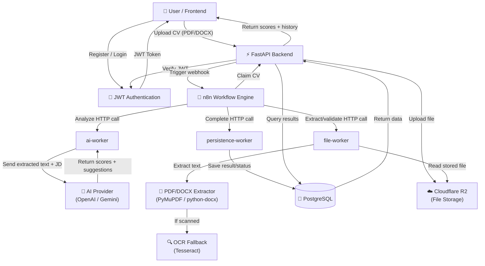
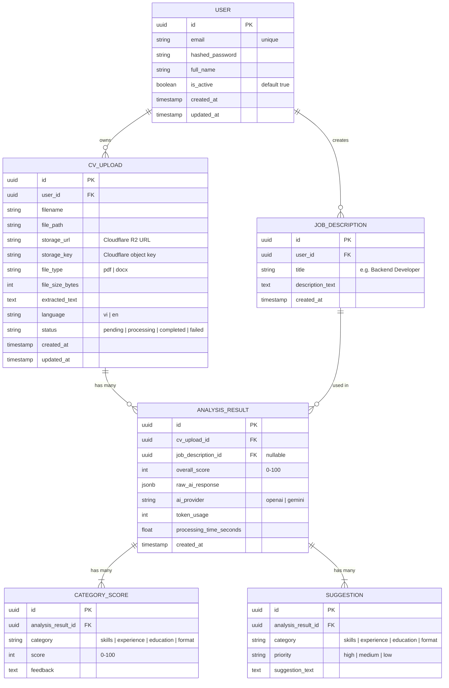

# System Design & Architecture

## Implementation Status Update (2026-04-26)

The runtime architecture has been finalized as a workerized n8n-centered pipeline:

- FastAPI handles upload, public read APIs, and internal `claim/fail`
- n8n orchestrates `claim -> extract -> validate -> analyze -> complete/fail`
- `file-worker` handles `extract/validate`
- `ai-worker` handles `analyze`
- `persistence-worker` handles `complete/save DB`

This means the active runtime no longer uses backend legacy execution routes for `extract`, `analyze`, or `complete`.

## Architecture Overview
**What is the high-level system structure?**


```mermaid
graph TD
    User["👤 User / Frontend"]
    Auth["🔐 JWT Authentication"]
    FastAPI["⚡ FastAPI Backend"]
    N8N["🔄 n8n Workflow Engine"]
    AI["🤖 AI Provider<br/>(OpenAI / Gemini)"]
    PDF["📄 PDF/DOCX Extractor<br/>(PyMuPDF / python-docx)"]
    OCR["🔍 OCR Fallback<br/>(Tesseract)"]
    DB[("🐘 PostgreSQL")]
    CF["☁️ Cloudflare R2<br/>(File Storage)"]

    User -->|"Register / Login"| Auth
    Auth -->|"JWT Token"| User
    User -->|"Upload CV (PDF/DOCX)"| FastAPI
    FastAPI -->|"Verify JWT"| Auth
    FastAPI -->|"Upload file"| CF
    FastAPI -->|"Trigger webhook"| N8N
    N8N -->|"Claim CV"| FastAPI
    N8N -->|"Extract/validate HTTP call"| FileWorker["file-worker"]
    FileWorker -->|"Read stored file"| CF
    FileWorker -->|"Extract text"| PDF
    PDF -->|"If scanned"| OCR
    N8N -->|"Analyze HTTP call"| AIWorker["ai-worker"]
    AIWorker -->|"Send extracted text + JD"| AI
    AI -->|"Return scores + suggestions"| AIWorker
    N8N -->|"Complete HTTP call"| PersistenceWorker["persistence-worker"]
    PersistenceWorker -->|"Save result/status"| DB
    FastAPI -->|"Query results"| DB
    DB -->|"Return data"| FastAPI
    FastAPI -->|"Return scores + history"| User
```

### Key Components & Responsibilities

| Component | Responsibility |
|-----------|---------------|
| **FastAPI Backend** | REST API, JWT authentication, file upload handling, webhook trigger to n8n, results querying, history endpoints |
| **JWT Authentication** | User registration, login, token generation & verification, route protection |
| **n8n Workflow** | Orchestrates the pipeline: receive webhook, claim work, call workers, and route terminal success/failure |
| **file-worker** | Extracts PDF/DOCX text, runs OCR fallback, and validates resume text |
| **ai-worker** | Calls the live AI provider and normalizes analysis payloads |
| **persistence-worker** | Persists final analysis results and marks CV uploads completed |
| **AI Provider** | Analyzes CV text, generates scores (0–100) with breakdown and improvement suggestions |
| **PostgreSQL** | Persistent storage for users, CV metadata, job descriptions, extracted text, AI scores, and analysis history |
| **Cloudflare R2** | Permanent cloud storage for uploaded CV files |

### Technology Stack

| Layer | Technology | Rationale |
|-------|-----------|-----------|
| Backend API | FastAPI (Python 3.11+) | Async, fast, auto-docs (Swagger), great Python ecosystem |
| Authentication | JWT (python-jose + passlib) | Stateless auth, scalable, widely supported |
| Workflow Engine | n8n (self-hosted) | Visual workflow builder, webhook support, extensible with custom code nodes |
| Database | PostgreSQL 16 | Robust, JSONB support for flexible AI response storage |
| File Storage | Cloudflare R2 (S3-compatible) | Cost-effective cloud storage, S3-compatible API, global CDN |
| Text Extraction | PyMuPDF + python-docx | PyMuPDF for PDF, python-docx for DOCX, fast and reliable |
| OCR | Tesseract OCR | Open-source OCR fallback for scanned PDFs |
| AI | OpenAI GPT-4 / Google Gemini | State-of-the-art language models for CV analysis |
| Containerization | Docker Compose | Single-command deployment of all services |

## Data Models
**What data do we need to manage?**

### Entity Relationship Diagram


```mermaid
erDiagram
    USER ||--o{ CV_UPLOAD : "owns"
    USER ||--o{ JOB_DESCRIPTION : "creates"
    CV_UPLOAD ||--o{ ANALYSIS_RESULT : "has many"
    JOB_DESCRIPTION ||--o{ ANALYSIS_RESULT : "used in"
    ANALYSIS_RESULT ||--|{ CATEGORY_SCORE : "has many"
    ANALYSIS_RESULT ||--|{ SUGGESTION : "has many"

    USER {
        uuid id PK
        string email "unique"
        string hashed_password
        string full_name
        boolean is_active "default true"
        timestamp created_at
        timestamp updated_at
    }

    JOB_DESCRIPTION {
        uuid id PK
        uuid user_id FK
        string title "e.g. Backend Developer"
        text description_text
        timestamp created_at
    }

    CV_UPLOAD {
        uuid id PK
        uuid user_id FK
        string filename
        string file_path
        string storage_url "Cloudflare R2 URL"
        string storage_key "Cloudflare object key"
        string file_type "pdf | docx"
        int file_size_bytes
        text extracted_text
        string language "vi | en"
        string status "pending | processing | completed | failed"
        timestamp created_at
        timestamp updated_at
    }

    ANALYSIS_RESULT {
        uuid id PK
        uuid cv_upload_id FK
        uuid job_description_id FK "nullable"
        int overall_score "0-100"
        jsonb raw_ai_response
        string ai_provider "openai | gemini"
        int token_usage
        float processing_time_seconds
        timestamp created_at
    }

    CATEGORY_SCORE {
        uuid id PK
        uuid analysis_result_id FK
        string category "skills | experience | education | format"
        int score "0-100"
        text feedback
    }

    SUGGESTION {
        uuid id PK
        uuid analysis_result_id FK
        string category "skills | experience | education | format"
        string priority "high | medium | low"
        text suggestion_text
    }
```

### Data Flow
1. **Register/Login:** User registers or logs in and receives a JWT token.
2. **Upload:** Authenticated user uploads a PDF/DOCX file. The backend stores the file, inserts `cv_upload` metadata with status `pending`, and triggers n8n.
3. **Claim:** n8n calls the backend internal claim endpoint. The backend owns status transitions and idempotency.
4. **Extraction:** n8n calls `file-worker`, which loads the stored file, extracts text, applies OCR fallback when needed, validates resume content, and returns the extracted payload.
5. **AI Analysis:** n8n calls `ai-worker`, which calls the live AI provider and normalizes the response into the internal workflow contract.
6. **Persistence:** n8n calls `persistence-worker`, which saves the analysis result and marks the CV upload as `completed`.
7. **Failure Handling:** any stage failure is routed through backend/internal fail handling so `failure_reason` and `failed_stage` stay consistent.
8. **Query:** FastAPI verifies JWT, reads from DB filtered by `user_id`, and returns public read models for status, history, and result screens.

## API Design
**How do components communicate?**

### Authentication API

#### `POST /api/v1/auth/register`
Register a new user.
```
Request: application/json
{
  "email": "user@example.com",
  "password": "securepassword",
  "full_name": "Nguyen Van A"
}

Response: 201 Created
{
  "id": "uuid",
  "email": "user@example.com",
  "full_name": "Nguyen Van A",
  "created_at": "2026-03-08T10:00:00Z"
}
```

#### `POST /api/v1/auth/login`
Login and receive JWT token.
```
Request: application/x-www-form-urlencoded
  - username: email
  - password: password

Response: 200 OK
{
  "access_token": "eyJhbGci...",
  "token_type": "bearer"
}
```

### External REST API (FastAPI) — 🔒 Requires JWT

#### `POST /api/v1/cv/upload`
Upload a CV file for analysis.
```
Headers: Authorization: Bearer <token>
Request: multipart/form-data
  - file: PDF or DOCX file (max 10 MB)
  - job_description_id: uuid (optional, reference to saved JD)

Response: 201 Created
{
  "id": "uuid",
  "filename": "resume.pdf",
  "storage_url": "https://r2.example.com/...",
  "status": "pending",
  "message": "CV uploaded. Analysis will be available shortly.",
  "created_at": "2026-03-08T10:00:00Z"
}
```

#### `GET /api/v1/cv`
List all CV uploads for the authenticated user.
```
Headers: Authorization: Bearer <token>

Response: 200 OK
{
  "success": true,
  "data": [
    {
      "id": "uuid",
      "filename": "resume.pdf",
      "status": "completed",
      "analysis_summary": {
        "overall_score": 78,
        "grade": "Good",
        "analysis_provider": "gemini"
      }
    }
  ]
}
```

#### `GET /api/v1/cv/{id}/status`
Poll the processing status of one CV upload.
```
Headers: Authorization: Bearer <token>

Response: 200 OK
{
  "success": true,
  "data": {
    "id": "uuid",
    "status": "pending | processing | completed | failed",
    "failure_reason": "string | null",
    "failed_stage": "orchestration | extract | analyze | complete | null"
  }
}
```

#### `GET /api/v1/cv/{id}/result`
Get analysis result for a completed CV (own CVs only). Returns `409` when the result is not ready.
```
Headers: Authorization: Bearer <token>

Response: 200 OK
{
  "success": true,
  "data": {
    "cv_id": "uuid",
    "filename": "resume.pdf",
    "overall_score": 78,
    "grade": "Good",
    "summary": "...",
    "breakdown": [],
    "strengths": [],
    "improvements": [],
    "suggestions": []
  }
}
```

### Job Description API — 🔒 Requires JWT

#### `POST /api/v1/jd`
Create a reusable job description.
```
Headers: Authorization: Bearer <token>
Request: application/json
{
  "title": "Backend Developer",
  "description_text": "We are looking for a Python backend developer..."
}

Response: 201 Created
{
  "id": "uuid",
  "title": "Backend Developer",
  "created_at": "2026-03-08T10:00:00Z"
}
```

#### `GET /api/v1/jd`
List all saved job descriptions for the authenticated user.
```
Headers: Authorization: Bearer <token>

Response: 200 OK
{
  "items": [
    { "id": "uuid", "title": "Backend Developer", "created_at": "..." },
    ...
  ]
}
```

### Internal Webhook (FastAPI → n8n)

#### `POST {N8N_WEBHOOK_URL}/webhook/analyze-cv`
```
{
  "cv_upload_id": "uuid"
}
```

### n8n -> Workers / Backend Internal APIs
n8n does not own business logic or write analysis data directly. It calls:
- backend internal `claim/fail` endpoints for state ownership
- `file-worker` for extraction and validation
- `ai-worker` for live AI analysis
- `persistence-worker` for saving results

## Component Breakdown
**What are the major building blocks?**

### Backend (FastAPI)
- `app/main.py` — Application entry point, CORS, lifespan events
- `app/api/routes/auth.py` — Register, login endpoints
- `app/api/routes/cv.py` — CV upload, list, status, and result endpoints
- `app/api/routes/jd.py` — Job description CRUD endpoints
- `app/api/deps.py` — JWT dependency injection (get_current_user)
- `app/models/` — SQLAlchemy ORM models (user, cv_upload, job_description, analysis_result, etc.)
- `app/schemas/cv_public.py` — User-facing CV response/read schemas
- `app/schemas/cv_internal.py` — Internal n8n/worker payload schemas
- `app/services/cv_queries.py` — CV/JD ownership and read/query helpers
- `app/services/cv_state.py` — CV upload creation and processing state transitions
- `app/services/cv_extraction.py` — Resume text extraction and validation stage logic
- `app/services/cv_analysis.py` — AI analysis service adapter
- `app/services/cv_persistence.py` — Analysis persistence and CV read-model builders
- `app/services/resume_parser.py` — File-to-text parser for PDF/DOCX plus OCR fallback
- `app/services/resume_validation.py` — Deterministic resume-text validator used after extraction
- `app/services/resume_analyzer.py` — Live AI provider orchestration only
- `app/services/ai_response_normalizer.py` — Pure response parsing, scoring, and normalization logic
- `app/services/legacy/mock_analyzer.py` — Legacy deterministic fixture, excluded from runtime pipeline
- `app/services/workflow_trigger.py` — n8n webhook trigger and orchestration failure sync
- `app/services/storage.py` — Local upload validation and optional Cloudflare R2 object upload
- `app/core/config.py` — Environment config (DB URL, n8n URL, AI keys, R2 credentials, JWT secret)
- `app/core/security.py` — JWT token utilities, password hashing
- `app/db/` — Database session, migrations (Alembic)

### n8n Workflow
- **Webhook Trigger Node** — Receives POST from FastAPI with `cv_upload_id`
- **Claim HTTP Node** — Calls backend internal claim API
- **File Worker HTTP Node** — Calls `file-worker` for extract/validate
- **AI Worker HTTP Node** — Calls `ai-worker` for live provider analysis
- **Persistence Worker HTTP Node** — Calls `persistence-worker` to save final results
- **Failure HTTP Node** — Calls backend internal fail API with `failed_stage` and `failure_reason`

### Database (PostgreSQL)
- 6 tables: `user`, `job_description`, `cv_upload`, `analysis_result`, `category_score`, `suggestion`
- Indexes on: `user.email`, `cv_upload.user_id`, `cv_upload.created_at`, `analysis_result.cv_upload_id`, `job_description.user_id`
- JSONB column for raw AI response (flexibility for schema evolution)

### Docker Compose Services
- `backend` — FastAPI public/internal API app (port 8000)
- `file-worker` — extraction/validation worker (internal Docker network)
- `ai-worker` — live AI analysis worker (internal Docker network)
- `persistence-worker` — result persistence worker (internal Docker network)
- `db` — PostgreSQL 16 (port 5432)
- `n8n` — n8n workflow engine (port 5678)
- n8n data persistence volume

## Design Decisions
**Why did we choose this approach?**

| Decision | Choice | Alternatives Considered | Rationale |
|----------|--------|------------------------|-----------|
| Authentication | JWT (python-jose) | Session-based, OAuth2 only, API keys | Stateless, scalable, standard for REST APIs, works well with frontend SPA |
| Workflow engine | n8n | Celery, Temporal, Airflow | Visual pipeline builder, easy to modify without code changes, built-in webhook support |
| Text extraction | PyMuPDF | pdfplumber, pdfminer, Apache Tika | Fast, lightweight, good text quality, pure Python |
| AI response format | Structured JSON via prompt engineering | Function calling, fine-tuned model | Simpler, works across OpenAI and Gemini, easy to validate |
| Score storage | Separate `category_score` table | JSONB in single column | Better querying, filtering, and aggregation for comparison features |
| File storage | Cloudflare R2 | S3, MinIO, local volume | Cost-effective, S3-compatible API, global edge network, no egress fees |
| JD storage | Separate `job_description` table | Text field in analysis_result | Reusable across analyses, avoids data duplication, enables JD management |

## Non-Functional Requirements
**How should the system perform?**

### Performance
- Upload + full analysis pipeline: < 30 seconds end-to-end
- API response time for history/results queries: < 200ms
- File upload: support up to 10 MB files

### Scalability
- v1: single-instance deployment (Docker Compose on one host)
- Future: horizontally scale FastAPI behind load balancer, n8n workers for parallel processing

### Security
- JWT-based authentication for all CV and JD endpoints
- Password hashing with bcrypt (via passlib)
- File validation: check MIME type and extension before processing
- Input sanitization: prevent path traversal in file uploads
- User data isolation: users can only access their own CVs and JDs
- API rate limiting: prevent abuse (e.g., 10 uploads/minute)
- AI API keys and Cloudflare R2 credentials stored as environment variables (not in code)
- JWT secret key rotation support

### Reliability
- n8n retry on AI API failure (3 retries with exponential backoff)
- Database connection pooling in FastAPI
- Health check endpoints for all services
- CV status tracking (pending/processing/completed/failed) for failure recovery
