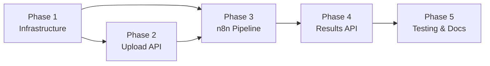

# Project Planning & Task Breakdown

## Milestones
**What are the major checkpoints?**

- [ ] **Milestone 1:** Infrastructure Setup — Docker Compose with FastAPI + PostgreSQL + n8n all running
- [ ] **Milestone 2:** CV Upload API — File upload endpoint, file storage, DB schema + migrations
- [ ] **Milestone 3:** n8n Processing Pipeline — Webhook → text extraction → AI analysis → DB save
- [ ] **Milestone 4:** Results & History API — Score retrieval, history listing, comparison endpoint
- [ ] **Milestone 5:** Integration Testing & Polish — End-to-end flow, error handling, documentation

## Task Breakdown
**What specific work needs to be done?**

### Phase 1: Infrastructure & Foundation
- [ ] **Task 1.1:** Create `docker-compose.yml` with 3 services: `backend` (FastAPI), `db` (PostgreSQL 16), `n8n`
  - [ ] Configure shared volume for file uploads
  - [ ] Set up environment variables (.env file)
  - [ ] Health check configuration for all services
- [ ] **Task 1.2:** Scaffold FastAPI project structure
  - [ ] `app/main.py` with CORS config and lifespan
  - [ ] `app/core/config.py` — Settings via Pydantic BaseSettings
  - [ ] `app/db/session.py` — SQLAlchemy async engine + session
  - [ ] `Dockerfile` for the backend service
  - [ ] `requirements.txt` / `pyproject.toml`
- [ ] **Task 1.3:** Database schema & migrations
  - [ ] Define SQLAlchemy models: `CvUpload`, `AnalysisResult`, `CategoryScore`, `Suggestion`
  - [ ] Set up Alembic for migrations
  - [ ] Create initial migration
  - [ ] Seed script (optional, for dev)

### Phase 2: CV Upload & File Processing
- [ ] **Task 2.1:** `POST /api/v1/cv/upload` endpoint
  - [ ] Accept multipart/form-data (PDF/DOCX, max 10 MB)
  - [ ] Validate file type (MIME + extension check)
  - [ ] Save file to shared volume
  - [ ] Insert `cv_upload` record (status: `pending`)
  - [ ] Return upload ID + status
- [ ] **Task 2.2:** Webhook trigger to n8n
  - [ ] HTTP POST to n8n webhook URL with cv_upload_id, file_path, file_type, optional JD
  - [ ] Handle n8n unavailability (retry / mark as failed)
- [ ] **Task 2.3:** Pydantic schemas for request/response validation
  - [ ] `UploadResponse`, `AnalysisResultResponse`, `HistoryResponse`, `CompareResponse`

### Phase 3: n8n Processing Pipeline
- [ ] **Task 3.1:** Create n8n workflow: Webhook Trigger
  - [ ] Receive POST with cv_upload_id, file_path, file_type, job_description
  - [ ] Validate payload
- [ ] **Task 3.2:** Text extraction node
  - [ ] Read file from shared volume
  - [ ] PDF extraction via PyMuPDF (or n8n Code Node running Python/JS)
  - [ ] DOCX extraction via appropriate library
  - [ ] OCR fallback for scanned PDFs (Tesseract, if text extraction yields empty result)
  - [ ] Update `cv_upload.extracted_text` in DB
- [ ] **Task 3.3:** AI analysis node
  - [ ] Construct prompt with extracted text + optional JD
  - [ ] Call OpenAI/Gemini API via HTTP Request node
  - [ ] Prompt engineering: request structured JSON output with overall_score, category scores, feedback, suggestions
  - [ ] Handle rate limiting and timeout (retry 3x)
- [ ] **Task 3.4:** Save results to PostgreSQL
  - [ ] Parse AI JSON response
  - [ ] Insert `analysis_result` row
  - [ ] Insert `category_score` rows (4 categories)
  - [ ] Insert `suggestion` rows
  - [ ] Update `cv_upload.status` to `completed`
  - [ ] On failure: update status to `failed`, log error

### Phase 4: Results & History API
- [ ] **Task 4.1:** `GET /api/v1/cv/{id}/result` — Fetch analysis result with category breakdown and suggestions
- [ ] **Task 4.2:** `GET /api/v1/cv/history` — Paginated list of all past analyses (filename, score, date)
- [ ] **Task 4.3:** `GET /api/v1/cv/compare` — Compare multiple CVs by IDs, return side-by-side scores
- [ ] **Task 4.4:** `GET /api/v1/cv/{id}/status` — Check processing status (polling endpoint)
- [ ] **Task 4.5:** Error handling & response standardization
  - [ ] Common error response schema
  - [ ] 404 for missing CVs, 400 for invalid input, 500 for pipeline failures

### Phase 5: Integration, Testing & Documentation
- [ ] **Task 5.1:** End-to-end integration test (upload → n8n processes → result available)
- [ ] **Task 5.2:** Unit tests for FastAPI endpoints (upload, result, history, compare)
- [ ] **Task 5.3:** API documentation (Swagger/OpenAPI auto-generated by FastAPI)
- [ ] **Task 5.4:** README with setup instructions, env variable reference, and usage examples
- [ ] **Task 5.5:** n8n workflow export (JSON) checked into repo

## Dependencies
**What needs to happen in what order?**

- **Phase 1 must complete first** — all other phases depend on Docker services running
- **Phase 2 and Phase 3 can partially overlap** — upload API can be built while n8n webhook node is configured
- **Phase 3 depends on Phase 2** — n8n receives webhook from upload endpoint
- **Phase 4 depends on Phase 3** — results API reads data written by n8n pipeline
- **Phase 5 depends on all** — integration testing requires full pipeline

### External Dependencies
- OpenAI or Gemini API key (must be provisioned before Phase 3)
- Docker & Docker Compose installed on dev machine
- n8n community edition Docker image

## Timeline & Estimates
**When will things be done?**

| Phase | Estimated Effort | Cumulative |
|-------|-----------------|------------|
| Phase 1: Infrastructure | 3–4 hours | 3–4 hours |
| Phase 2: Upload API | 3–4 hours | 6–8 hours |
| Phase 3: n8n Pipeline | 4–6 hours | 10–14 hours |
| Phase 4: Results API | 2–3 hours | 12–17 hours |
| Phase 5: Testing & Docs | 3–4 hours | 15–21 hours |
| **Total** | **15–21 hours** | — |

> Buffer: Add ~20% for unknowns (AI prompt tuning, n8n debugging) → **~18–25 hours total**

## Risks & Mitigation
**What could go wrong?**

| Risk | Likelihood | Impact | Mitigation |
|------|-----------|--------|------------|
| AI response not matching expected JSON schema | High | Medium | Validate response, add retry with rephrased prompt, fallback to regex parsing |
| n8n workflow complexity (debugging) | Medium | Medium | Keep workflow simple, add error-handling branches, log all steps |
| OCR quality on scanned PDFs | Medium | High | Use Tesseract with pre-processing (deskew, contrast), flag low-confidence extractions |
| AI API rate limiting / cost | Medium | Medium | Implement token tracking, set daily limits, cache repeated analyses |
| Docker networking issues between services | Low | High | Use explicit network in docker-compose, test connectivity early |
| Large file uploads causing memory issues | Low | Medium | Stream file to disk, don't load entire file in memory |

## Resources Needed
**What do we need to succeed?**

### Tools & Services
- Docker Desktop (or Docker Engine + Compose)
- Python 3.11+
- OpenAI API key or Google Gemini API key
- n8n community edition (Docker image: `n8nio/n8n`)
- PostgreSQL 16 (Docker image: `postgres:16`)

### Key Libraries
- `fastapi`, `uvicorn` — Web framework
- `sqlalchemy[asyncio]`, `asyncpg` — Database ORM
- `alembic` — Migrations
- `pymupdf` (fitz) — PDF text extraction
- `python-docx` — DOCX text extraction
- `python-multipart` — File upload parsing
- `httpx` — Async HTTP client (for n8n webhook calls)
- `pydantic-settings` — Configuration management
